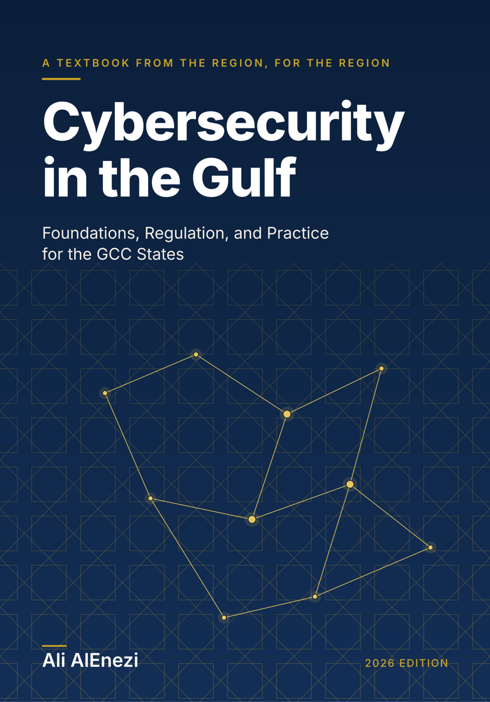

# Cybersecurity in the Gulf

**Foundations, Regulation, and Practice for the GCC States**  
by Ali AlEnezi. 2026 edition.

<p align="center">
  
</p>

A cybersecurity textbook written in the Gulf, for the Gulf. It treats the six states of the Gulf Cooperation Council as one cyber theatre: shared infrastructure that runs on desalinated water, exported energy and digital government; adversaries who have targeted the region since the Shamoon attacks of 2012; national authorities built within the same decade; and six legal frames that differ in the detail that decides what a security programme must contain. It is written for universities, government and practitioners across Bahrain, Kuwait, Oman, Qatar, Saudi Arabia and the United Arab Emirates.

This repository is the public companion to the book. It carries the table of contents, course materials, templates for the exercises, errata and links to the open source tools used in the text. The book itself is sold in paperback and Kindle editions; it is not available here.

## Where to buy

Paperback (7 by 10 inch) and Kindle editions on Amazon. ISBN 979-8178793312, imprint Independently published. The listing link will be added here when the book goes on sale. Companion site: https://cyberingulf.3li.info

## Contents of the 2026 edition

**Part I: The Gulf Cyber Landscape**

1. The Gulf as a Cyber Theatre
2. Threat Actors and Landmark Incidents
3. National Cybersecurity Governance
4. Laws, Regulations, and Standards

**Part II: Foundations with a Regional Lens**

5. Principles of Security Engineering and Risk
6. Identity, Access and National Digital Identity
7. Cryptography and Trust Infrastructure
8. Network and Cloud Security, Residency and Sovereignty
9. Application Security and Open Banking
10. Data Protection and Privacy Engineering
11. Security Architecture in Practice
12. Zero Trust Architecture
13. Post Quantum Migration

**Part III: Sectors and Operations**

14. Critical Infrastructure and Operational Technology
15. Telecommunications and Digital Infrastructure
16. Healthcare Security
17. Financial Services Security
18. Government, Smart Cities and Digital Services
19. Security Operations, Threat Intelligence and Incident Response
20. Offensive Security and Assurance
21. People, Culture and Workforce

**Part IV: Horizons**

22. Emerging Technologies
23. Cyber Resilience and National Strategy

**Appendices:** regulatory quick reference for the six states; a fourteen week course map; the open source companions; four instruments in depth, Kuwait's National Basic Cybersecurity Controls (Decision No. 2 of 2026) with all 44 controls and a roadmap, Saudi Arabia's Essential Cybersecurity Controls ECC-2:2024 subdomain by subdomain, the Central Bank of Kuwait's Cyber and Operational Resilience Framework baseline by baseline, and Qatar's National Information Assurance Standard domain by domain, each with a crosswalk; the Emirati, Bahraini and Omani instruments; a chronology of Gulf cybersecurity from 1981 to 2026; acronyms; a research agenda for the region's universities; the notification clocks the instruments state in numbers; glossary; index.

Every chapter opens with learning objectives and closes with a summary, key terms, review questions, research exercises and sources, and every chapter covers all six states.

## What is here

| Path | What it is |
|:--|:--|
| [`companion/course-map.md`](companion/course-map.md) | A fourteen week syllabus built on the book, with activities and assessments |
| [`companion/templates/`](companion/templates/) | Spreadsheet templates for the regime inventory, the crosswalk and the incident notification register used in the Chapter 4 exercises |
| [`companion/open-source-tools.md`](companion/open-source-tools.md) | The open source tools referred to in the exercises |
| [`ERRATA.md`](ERRATA.md) | Corrections since printing |

## For lecturers

A question bank with answers (three multiple choice items and a short answer prompt per chapter) and a set of lecture slides, one deck per chapter, are available to lecturers who have adopted the book. Request it through an issue in this repository stating your institution and course.

## About the author

Ali AlEnezi is a senior security architect in Kuwait. He leads security architecture at the largest financial institution in the country, chairs the Cyber Risk and Security Committee serving Kuwait and the Gulf, served on the board of one of the largest information technology companies in Kuwait, and maintains a portfolio of open source security tools for the region.

## Errata

Laws, regulations and frameworks in the region are reissued every year. If you find an error or an instrument that has changed, open an issue with the chapter and page, the sentence as printed, the correction and the official source. Corrections are listed in `ERRATA.md` and incorporated in the next printing, with credit.

## Citing

```
AlEnezi, A. (2026). Cybersecurity in the Gulf: Foundations, Regulation, and Practice for the GCC States. First edition.
```

A machine readable citation is in [`CITATION.cff`](CITATION.cff).

## Copyright

The book, its text, diagrams and cover are copyright 2026 Ali AlEnezi, all rights reserved. The templates in `companion/templates/` may be used freely by readers in their own work.
